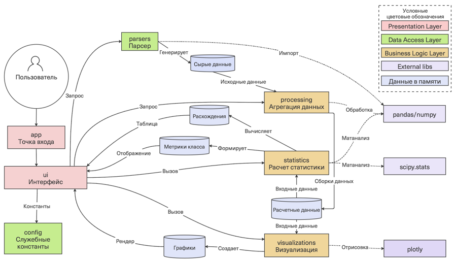

В данной директории размещен программный код ПО "School Analytics"

Как запустить проект:
1. Клонировать репозиторий
2. Установить зависимости
```
pip install -r requerements.txt
```
3. Запустить приложение
```
streamlit run app.py
```

Архитектура приложения


